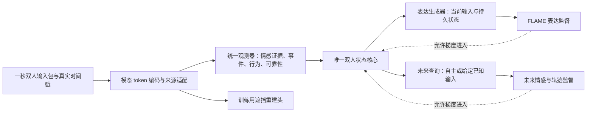

**统一情感 Avatar：下一版实施设计（2026-09-08，待实施）**

本设计对应用户提出的七项问题。本轮完成了代码审计和设计，没有修改训练逻辑或启动重训。核心任务保持为：根据双方历史状态、当前上下文、用户音频/FLAME 和 Avatar 音频，学习 Avatar 的连续表达及强度；FLAME 是条件表达的示范监督，不强制增加“关切/安慰”策略分类器。

**七项问题的处理决定**

| 用户问题 | 决定 | 实施边界 |
|---|---|---|
| 遮挡上下文重建 | 增加真正的 token/时间片段重建，并保留情感约束 | 不把池化向量维度置零等同于 token 重建；不以重建变好替代情感验收 |
| 训练有效利用长期状态 | 让表达监督及未来预测监督能训练到状态模块 | 不用强制输出变化的损失制造“有记忆” |
| DualTalk 视觉类型 | 当前项目原生使用 FLAME 56 维 | 50 exp + 3 jaw + 3 head pose；AU 使用独立输入适配器 |
| 长时记忆与未来预测 | 一起重新设计状态及训练目标 | 区分观测校正、无未来输入预测、已知未来输入的条件预测 |
| 统一情感表征空间 | 统一坐标、时间语义、角色语义、状态核心和读出 | 允许同一坐标下不同时间尺度，不能把“统一”简化成所有映射为 Identity |
| 按秒推进 | 三阶段默认都使用一秒 packet、实际 dt | 保留块内音频/视觉时间 token；标签仍按真实标注时间使用 |
| 双人影响 | 用对方后续情感和自身表达训练非对称影响 | 自然示范可学习条件反应；额外因果策略主张需独立证据 |

**已确认、直接影响重构的代码事实**

- `dataset_train.py:53` 读取 `exp`，`:54` 读取 `pose[:,3:]` 下颌，`:55` 读取 `pose[:,:3]` 头姿。`DualTalk.py:11` 默认 56 维。DualTalk 不是从 AU 改成 FLAME；是上游 AU 情感观测路线需要适配原有 FLAME。
- `models/streaming.py:50` 冻结 observer/SSM，`:157` 的 `no_grad` 再次阻断梯度，`:186` 返回时 detach，`train/generation.py:212` 每秒再次 detach。只修改 `requires_grad` 不足以恢复历史学习。
- `train/dynamics_core.py:386` 的 open-loop 只调用 `decay_only`；`:623` 的 pure-decay 对照也是同样计算。相同起点和读出下两者相同，不能用这个定义证明超出纯衰减的自主预测能力。
- `models/dynamics.py` 的 `observe` 与旧 `step/transition/step_parallel` 存在不同时间顺序；旧 rollout 和 `infer/trajectory.py` 还会进入旧路径。当前新版主训练和生成已使用 observe，不能把旧路径问题误报为它们每步都在出错。

**统一系统结构**

最终只维护一个观测器、一个状态核心、一套未来展开服务。各训练阶段改变监督和参数权限，不重新实现不同的状态公式。

**1. 数据包统一到秒，模态内部保留序列**

定义 `DyadicPacket`：session/dialogue、角色、start/end、实际 dt、每模态 token 与 token 时间、长度和可靠性、文本可用时间、唯一事件 ID、新增行为持续时间、监督及其有效时间范围。部署默认一秒、25 帧；时间 API 保留实际 dt，用于尾块、不等间隔和之后更短的更新粒度。

音频保留块内时序特征，FLAME 保留 25 帧，文本保留 token、角色和外部可用时间。统一更新频率不等于每个模态只剩一秒一个平均向量。上下文只能包含当前终点之前已经可见的内容；外部 ASR 迟到后不回写已经输出的结果。

EmotionTalk/IEMOCAP 的音频、视觉和文本都按同一时钟构造 packet。句子级标签只在对应句子范围聚合监督，或在真实标注终点施加损失；不复制成未经确认的逐秒标签。无时间对齐的文本仍按实际声明的可用时间进入，不通过插值制造逐词可见性。

每个数据来源保留模态类型、提取器及归一化版本。新增 token 缓存升级版本；已有池化缓存不能静默冒充 token 序列。无可靠人脸身份的 AU 保持缺失。没有可靠对话映射的 DualTalk 文件不拼接。

**2. 遮挡重建服务于情感和时间信息**

先在模态内形成时间/token 序列，再遮挡连续片段、部分词或整块模态，学生预测被遮挡的目标。遮挡发生在学生上下文编码之前，避免未遮挡的隐藏向量已经通过完整上下文读取了被遮挡内容。教师仅为训练提供目标，并且不读取目标时刻之后的内容。

优先重建经过归一化的特征 token 和 FLAME 运动特征，不以逐点还原原始波形为默认主任务。保留现有有效情感标签、VAD mask、逐域逐模态方差和协方差约束，防止模型只学身份、文本内容或局部运动。模态间对齐需按真实可靠性加权，不能强迫不可靠视觉与 A/T 教师完全相同。

统一 affect 必须从真正的多模态时序融合输出读取；模态专属 token 及重建头只用于保留输入信息，不建立几套相互独立的情感坐标。七种非空模态子集继续覆盖。

FLAME 路线在这一阶段就参与训练：独立的 FLAME 适配器与 AU 适配器进入同一空间。保留视觉自身的遮挡/运动重建和适度跨模态约束，不能只向 A/T 教师的平均向量靠拢。真实 Avatar 当前 FLAME 仍只作目标，禁止进入观测输入。

验收分别查看重建质量、独立情感识别、跨域迁移和对最终任务的预测价值。V-only 必须超过固定均值；AVT 相对 AT 的增量作用也要报告。上述两项不互相替代。

**3. 同一情感坐标内保留快慢成分**

建议第一版使用同一情感坐标下的快、慢时间成分，而不是给每个模态或数据集创建独立状态。示意：每人状态包含 `fast` 和 `slow`，双方另有 relation；当前情感通过共享读出由这些成分得到。观测器、未来读出、情感标签头共享同一坐标定义。

可实现的起始参数化为 `readout = baseline + fast + slow`，观测校正根据 `y - readout(prior)` 分配给快慢成分。快通道响应当前证据，慢通道使用受约束的较低更新率；连续事件和双方影响可以更新慢成分。当前完整状态不再被 128 维瞬时观测全维直接替换。

快慢分解不是已经验证的心理学事实，需要通过不同预测时间尺度、当前反应准确性和历史消融来验证。防止慢分量学成无用常量，也防止靠固定偏置或不衰减制造长记忆。必须直接从未来预测和表达任务获得训练信号。

自然演化、持续行为作用和校正强度都使用真实秒数。校正率以每秒有效证据量参数化，而非每调用一次固定覆盖 65%–68%；已有历史文本不按新证据重复计数，新增文本事件按唯一 ID 只注入一次。沉默时可以有视觉证据，纯历史文本不能自动视作新的持续言语行为。

纯衰减仍保持时间组合一致性。两种不同采样频率若带来不同真实观测，不要求输出强行完全相同；对相同事件清单、相同查询时刻和相同积分设置，训练/推理重放必须一致。

**4. 未来预测必须使用真正训练的自主演化**

共用 `forecast(state_at_origin, query_times, known_future_inputs=None)`：

- 自主预测：只使用起点已有状态和历史，绝不读取查询区间真实音频、FLAME、文本、affect 或 action。
- 条件预测：可以使用在起点已知或明确声明提供的 Avatar 计划语音/文本等条件，不能读取未声明的未来用户输入或未来 affect。实验若使用未来真实行为，应标为 oracle conditional，与在线可用条件分开。

当前自主预测就是纯衰减。下一版在状态核心中加入受稳定性约束的自主转移，可利用历史形成的变化趋势、快慢成分和已有关系状态；无外部输入时预测条件期望，不假设能预知新事件。纯衰减保留为独立基线。

候选实现可从稳定连续时间线性转移起步：对扩展状态偏移使用 `exp(A * dt)`，例如通过 `A = -L L^T + (S-S^T) - eps I` 约束固定转移的稳定性，再增加受约束的输入和非对称耦合。具体参数化需在小模型对照中选择；不能把训练得到一个任意 MLP 就当作稳定性保证。时间常数解释需依据最终参数化重新定义，不沿用旧对角 tau 的结论。

时间推进、已知事件注入和终点观测校正都由唯一核心按时间戳执行；同一事件不重复计入。future rollout 关闭真实观测校正，训练器不得再手写另一套步进规则。

主要查询使用 1、2、4、8、16、32 秒；更长查询只能在真实连续对话与有效目标存在时评估。目标来自对应时刻的有效情感标注或固定教师，教师只使用截至目标时刻的可见输入，输出 stop-gradient。长跨度没有标签时 mask，不插值出真值。

对照包括 last-state、训练均值、pure-decay 和学习的自主转移。只有优于这些对照，才说明预测超出了静态保持或简单恢复。条件预测单独比较，不把知道未来行为带来的收益算作无输入预测收益。

**5. 表达损失和未来损失共同训练历史状态**

模型前向保持可微，不内置训练阶段的永久 `no_grad`、冻结或每秒 detach。推理由外层 `inference_mode` 管理。训练器决定可训练参数、各组学习率、梯度裁剪和 TBPTT 边界。

联合目标包含：

`L = L_FLAME + lambda_future L_future + lambda_mask L_mask + lambda_anchor L_coordinate + lambda_reg L_regularization`。

其中 FLAME 监督让状态保留有助于实际表达的历史，未来损失让状态保留有助于多步预测的信息，坐标保持约束和独立情感监督防止状态变成任意动作编码。权重是验证集选择的超参数，不预先承诺固定数值有效。

固定坐标不等于冻结整个状态网络。A0 通过验收后保存固定教师和情感读出参考；后续允许动力学、输入适配器及任务读出学习，必要时对共享观测器小学习率适配，同时监测独立情感指标和教师保持误差。不能把 observer、SSM、生成器一齐无约束解冻，也不能继续依靠当前很弱的 FLAME 投影器给自己验证。

序列按完整对话顺序运行，梯度按连续片段截断，状态数值持续保留。32 秒作为最大 TBPTT 展开长度；实际每批展开长度遵守有效新块和显存预算，例如双卡每步 32 个有效新块时可每卡一个 16 秒连续片段。每次优化器更新前处理完该段梯度，跨更新边界 detach，禁止保留经过参数原地更新的旧计算图。

可用不计目标损失的历史 burn-in 建立更长状态，但这不等于梯度覆盖了全部 burn-in。多秒未来预测和更长真实对话训练共同验证长期信息是否有用。

训练中可有部分观测缺失、当前块遮挡、未来 open-loop 展开等任务，要求状态补充缺失信息。不能对所有样本强加“真历史一定优于任何替代历史”的 margin；很多片段本来不需要远期历史。最终仍在完整真实输入上测试。

**6. 双人影响的训练和验收**

两方向共享情感坐标，建议共享有序的 sender/receiver 影响函数，由两人的状态、行为和定向关系产生非对称作用，避免把差异固化为 A/B 槽位偏差。关系明确使用可交换的定向表示或交换算子。预测目标包括对方后续情感变化，以及自身接收对方信息后的真实表情。行为编码在新的 FLAME/音频/文本协议上一起适配，不能只校准 affect 后假定 action 已兼容。

专项审计新增两项必须修复的输入契约：共享对话文本必须通过目标角色查询读出各人的情感；历史文本存在不等于当前新增行为存在。分别维护 context_available、fresh_observation、event_present、action_present 和行为持续时间。旧文本保留上下文作用，不重复作为外源行为注入；当前有效视觉在沉默时仍可产生非语言影响。详见 [双人耦合专项审计](D:/Projects/digman-ways/DualTalk/docs/dyadic_coupling_audit_2026-09-08.md)。

三类实验分别回答：

- 历史：固定当前输入和最近三秒，保留/重置更早状态，比较真实后续轨迹误差；同时记录历史文本是否保留，防止实验名称与实际干预不一致。
- 持续、衰减、积累：在人工确认或可靠规则识别的事件上测方向、延迟、持续、重复事件后的变化；自然片段与人工脉冲探针分开。不是越持久、越强烈就越好。
- partner：在接收者起点状态、当前输入及语境尽量可比时，观察对方历史/行为对真实后续反应的预测贡献；修正说话/背景声区分，确保有足够倾听样本。

自然示范支持学习隐式关切、安慰及表达强度，不要求先训练离散策略分类。若要声称具体策略对用户的因果效果，需要真实干预或更强设计，不能仅用随机换向量验证。

跨对话替代行为可以作辅助检验，但候选覆盖率、普通排序率和 margin 成功率分别计算，命名与定义保持一致；候选不合格时不给虚假零分。多个合理回应不应自动全部当成错误负样本。

**有边界的代码重构**

保留：原 DualTalk 生成主干、时间/角色与可见文本检查、验证划分、有效元素加权评测、完整 checkpoint 恢复、四种对照预算、会话状态容器及最多三秒生成上下文。这些已经修好的部分不用重写。

收拢：

| 边界 | 改法 |
|---|---|
| 数据 | 在现有 protocol 和 timed loader 上增加共用 packet/token contract，让上游与生成数据提供同样结构 |
| 观测 | 模态适配、时序融合、统一 affect 读出合为一条主线；训练用重建头挂在明确位置 |
| 状态 | 唯一 `advance` 和 `forecast` 核心；旧 step/transition/rollout 迁入明确 legacy 兼容路径 |
| 训练 | A0、动力学、联合生成共享核心；冻结与 TBPTT 由 trainer 管理，移除前向中的硬编码 |
| 推理 | 流式生成、未来轨迹和干预实验调用同一时间核心，不再自行执行两次 dt/2 等旧逻辑 |
| 恢复 | 通用 checkpoint 读取/配置放统一模块；factory 不反向依赖旧 trainer 私有函数 |

新 packet、token 特征、状态结构、自主转移和梯度协议需要新模型/数据版本。现有 v2 checkpoint 保留原协议显式加载；只将形状和语义兼容的权重作为新实验初始化，不带旧优化器继续称为同次训练。

**实施顺序与退出条件**

1. 先收拢核心调用和训练权限，用兼容适配器保持 v2 数值回放一致；记录旧入口使用情况，避免重构本身改变既有结论。
2. 实现秒级 token 数据和遮挡观测训练，接入 FLAME；通过来源、因果可见性、mask、独立情感与视觉增量检验。
3. 实现统一快慢状态和学习的自主预测；先完成小模型梯度、时钟、事件、缺失观测及未来泄漏测试，再跑上游预测对照。
4. 接入连续片段联合表达训练，验证未来表达损失能对更早状态参数产生有效梯度，同时情感坐标和识别指标保持可用。
5. 运行四组相同 25 帧协议的诊断及影响实验。通过后再安排 30000 步、多种子正式对照；记录额外上游训练成本和新增状态参数，不能声称所有模型总计算量相同。

必须新增或更新的验收：真正 token 遮挡且无隐藏输入泄漏；共享情感坐标；跨秒梯度不被意外截断；长状态对相关未来目标有贡献；自主预测与纯衰减在结构上可区分且收益实测；所有未来入口不读取未声明输入；同一事件一次注入；稳定性和纯衰减时间组合；完整 checkpoint 独立恢复；训练/评测/流式数值一致；真实与无关历史分别检验；说话、倾听与尾块覆盖。

短片段可以验证代码和秒级机制，不能替代分钟级记忆证据。若最终要主张分钟级持续状态，需增加可靠连续对话映射和足够长的独立测试；不按文件编号猜测连续性。
